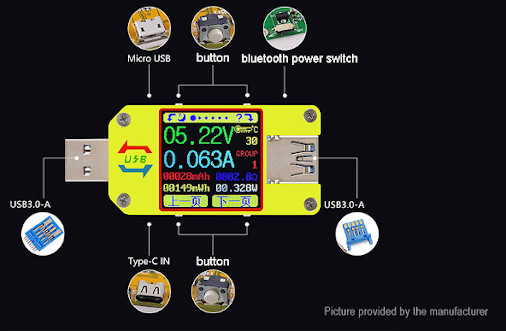

# Description
This program communicates with UM34C via bluetooth. It can store UM34C's data in CSV file.  
It was tested on Ubuntu 18.04 and on Raspbian (Raspberry Pi Zero W and 3b+).  

# Install
1. Install bluetooth library:  
`sudo apt install libbluetooth-dev`
2. Install ncurses library:  
`sudo apt install libncurses5-dev`
3. Install make:  
`sudo apt install make`
4. Install gcc:  
`sudo apt install gcc`
5. Open root folder of this project and build the program with:  
`make`

# Usage
* Stop running program by pressing: `CTRL+C` or `c`  
* Once program is build/compiled type to start the program:  
`build/um34c`  
* Specify UM34C's bluetooth address (there is actually no need for this, program can search for UM34C device and than store its address in `um34c_addr.txt` for later usage (next time you run the program)):  
`build/um34c -a 00:15:A3:00:2D:BF`  
* Specify interval in which data from UM34C is queried (in ms) - default value is 500ms and minimal is 400ms. This example sets it to 1000ms which is 1s:  
`build/um34c -q 1000`  
* Start reading device on startup:  
`build/um34c -r`  
* Start reading device and saving data to CSV file on startup:  
`build/um34c -r -csv`  
* Append average from X samples of voltage and current to CSV file (in this case every 20 samples average is appended to CSV file and becasue we set query interval to 500ms every 10 seconds value is appended to CSV file):  
`build/um34c -f 20 -q 500`
* Set record current threshold in cA (at which current measuring mAh and mWh starts). Here we set it to 5cA which is 0.05A:
`build/um34c -i 5`
* If GUI is not used (for example program runned in background) use `-n` flag, example of programm running in background:  
`build/um34c -f 4 -q 500 -r -csv -i 5 -n > /dev/null &`   
    * To kill program like that run `ps aux | grep um34c` and than `kill yourPID` where 'yourPID' is PID you got from command before.

## In application
* Press `h` to display/close help
* Exit application: `CTRL+C` or `c`
* Move to previous/next display: `LEFT`/`RIGHT`
* Toggle data sampling: `SPACE`
* Toggle saving to CSV file: `s`
* Rotate screen: `r`
* Set device brightness:
  1. First press `b`
  2. Than change brightness with `UP`/`DOWN`
* Set record current threshold (when recording (mAh and mWh) starts):
  1. First press `i`
  2. Than change threshold with `UP`/`DOWN`
* Set screen timeout (`0` is OFF, `9` is 9 min):
  1. First press `t`
  2. Than select timeout with `0`-`9`
* Set data group:
  1. First press `g`
  2. Than select data group with `0`-`9`

# Thanks
Thanks to 'sebastianha' who inspired this project. Here is [LINK](https://github.com/sebastianha/um34c) to his project.
There is also a lot of info on 'sigrok' website [LINK](https://sigrok.org/wiki/RDTech_UM_series).

# Suggestions
If you have any suggestions please let me know.

# License
Licensed under the GPLV3 License